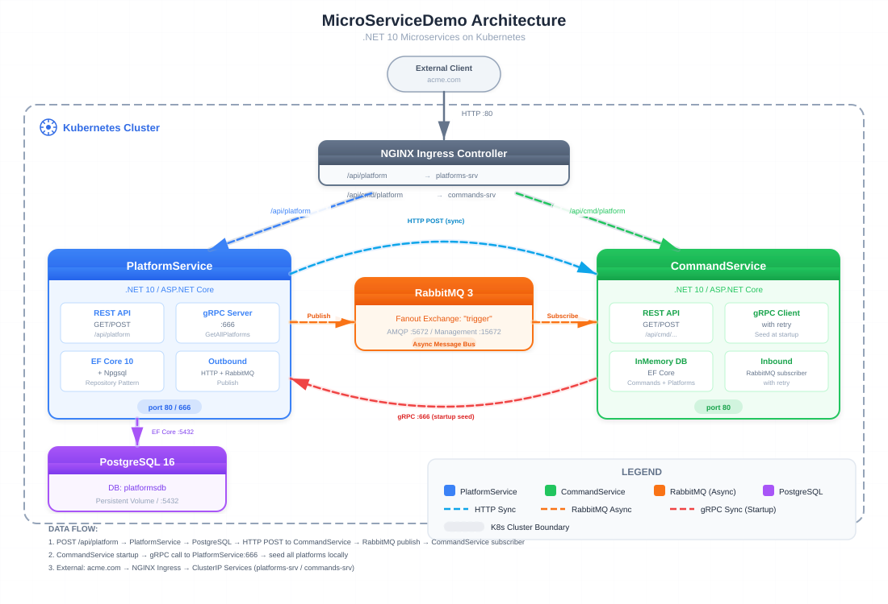

# MicroServiceDemo / 微服务演示

A .NET 10 microservices demo with Kubernetes deployment, demonstrating synchronous (HTTP, gRPC) and asynchronous (RabbitMQ) inter-service communication.



## Tech Stack / 技术栈

| Category | Technology |
|----------|-----------|
| Runtime | .NET 10, ASP.NET Core |
| Database | PostgreSQL 16 (PlatformService), InMemory (CommandService) |
| ORM | EF Core 10 + Npgsql |
| gRPC | Grpc.AspNetCore 2.80 |
| Message Bus | RabbitMQ 3 (fanout exchange) |
| Mapping | AutoMapper 16 |
| API Docs | Swashbuckle.AspNetCore 10 |
| Frontend | HTML/CSS/JS (vanilla, no framework) |
| Container | Docker, Kubernetes (Docker Desktop) |
| Ingress | NGINX Ingress Controller |

## Modules / 模块

| Service | Project | Responsibility |
|---------|---------|---------------|
| PlatformService | `PlatformService/` | CRUD for platforms, publishes changes to CommandService via HTTP + RabbitMQ, exposes gRPC server |
| CommandService | `CommandService/` | CRUD for commands per platform, receives platforms via HTTP sync + RabbitMQ + gRPC client |
| Frontend | `frontend/` | Management console for platforms and commands |

## Data Flow / 数据流

1. **Create Platform**: `POST /api/platform` → PlatformService saves to PostgreSQL → HTTP POST sync to CommandService → RabbitMQ async publish → CommandService creates local Platform
2. **Startup Sync**: CommandService starts → gRPC call to PlatformService:666 → seeds all existing platforms (with retry)
3. **Seed Sync**: PlatformService startup seeds 3 platforms → HTTP POST syncs each to CommandService
4. **External Access**: NGINX Ingress routes `acme.com/api/platform` → PlatformService, `acme.com/api/cmd/platform` → CommandService

```
External Client
      │
      ▼
 NGINX Ingress (acme.com)
   ┌────┴────┐
   ▼         ▼
PlatformService ──HTTP POST──► CommandService
      │                              ▲
      ├──RabbitMQ (fanout)───────────┘
      │                              │
      └──gRPC Server :666     gRPC Client (startup)
      │                              │
 PostgreSQL 16                  InMemory DB
```

## Quick Start / 快速开始

### Prerequisites / 前提条件

- .NET 10 SDK
- Docker Desktop (with Kubernetes enabled) or Minikube
- kubectl CLI

### Local Development

```bash
# 1. Start CommandService first (port 8080, Chrome blocks port 6000)
cd CommandService
ASPNETCORE_ENVIRONMENT=Development dotnet run --urls="http://localhost:8080"

# 2. Start PlatformService (port 5000, seeds data and syncs to CommandService)
cd PlatformService
ASPNETCORE_ENVIRONMENT=Development dotnet run --urls="http://localhost:5000"

# 3. Start Frontend (port 3000)
cd frontend
python -m http.server 3000
```

Open http://localhost:3000 in your browser.

> **Note**: Dev mode uses InMemory DB for both services. RabbitMQ and gRPC sync are not available locally; platforms are synced via HTTP POST instead.

### Build Docker Images

```bash
cd PlatformService && docker build -t huamu/platformservice:latest .
cd CommandService && docker build -t huamu/commandservice:latest .
```

## Deploy to Kubernetes / 部署到 K8S

### Architecture

```
acme.com
    │
    ▼
 NGINX Ingress
   ┌────────┴────────┐
   ▼                  ▼
PlatformService    CommandService
   :80/:666            :80
   │                    ▲  ▲
   │ HTTP POST ─────────┘  │
   │ RabbitMQ fanout ──────┘
   │ gRPC :666 ────────────┘
   │
   ▼
PostgreSQL :5432
```

### Step 1: Build Docker Images

```bash
cd PlatformService && docker build -t huamu/platformservice:latest .
cd CommandService && docker build -t huamu/commandservice:latest .
```

### Step 2: Deploy Infrastructure

```bash
# 1. Persistent storage for PostgreSQL
kubectl apply -f K8S/local-pvc.yaml

# 2. Create database password secret
kubectl create secret generic postgres --from-literal=POSTGRES_PASSWORD="pa55w0rd!"

# 3. PostgreSQL
kubectl apply -f K8S/postgres-depl.yaml

# 4. RabbitMQ
kubectl apply -f K8S/rabbitmq-depl.yaml

# 5. Wait for infrastructure pods to be ready
kubectl wait --for=condition=ready pod -l app=postgres --timeout=60s
kubectl wait --for=condition=ready pod -l app=rabbitmq --timeout=60s
```

### Step 3: Deploy Application Services

```bash
# 6. PlatformService (HTTP :80 + gRPC :666)
kubectl apply -f K8S/platforms-depl.yaml
kubectl apply -f K8S/platforms-np-srv.yaml

# 7. CommandService (HTTP :80)
kubectl apply -f K8S/commands-depl.yaml
```

### Step 4: Configure Ingress

```bash
# 8. Install NGINX Ingress Controller
kubectl apply -f https://raw.githubusercontent.com/kubernetes/ingress-nginx/main/deploy/static/provider/cloud/deploy.yaml

# 9. Apply routing rules
kubectl apply -f K8S/ingress-srv.yaml
```

### Step 5: Configure Local DNS

Ingress uses the domain `acme.com`. Edit your hosts file:

**Windows**: `C:\Windows\System32\drivers\etc\hosts` (run as Administrator)
**Linux/Mac**: `/etc/hosts`

```
127.0.0.1  acme.com
```

> If using Minikube, replace `127.0.0.1` with the output of `minikube ip`.

### Step 6: Verify

```bash
# Check all pods are running
kubectl get pods

# Test the API
curl http://acme.com/api/platform
```

### Cleanup / 清理

```bash
kubectl delete -f K8S/ingress-srv.yaml
kubectl delete -f K8S/commands-depl.yaml
kubectl delete -f K8S/platforms-depl.yaml
kubectl delete -f K8S/platforms-np-srv.yaml
kubectl delete -f K8S/rabbitmq-depl.yaml
kubectl delete -f K8S/postgres-depl.yaml
kubectl delete -f K8S/local-pvc.yaml
kubectl delete secret postgres
```

## EF Core Migrations (PlatformService)

```bash
cd PlatformService
dotnet ef migrations add <Name>
dotnet ef database update
```

Migrations apply automatically in Production environment via `PrepDb`.

> **Note**: `DesignTimeDbContextFactory` uses `POSTGRES_PASSWORD` env var (falls back to dev default). In K8S Production, this password is injected via the `postgres` secret -- the PlatformService Startup substitutes the `PA55W0RD_PLACEHOLDER` token in the connection string at runtime.

## API Endpoints

### PlatformService (http://localhost:5000)

| Method | Route | Description |
|--------|-------|-------------|
| GET | `/api/platform` | Get all platforms |
| GET | `/api/platform/{id}` | Get platform by ID |
| POST | `/api/platform` | Create platform (triggers HTTP sync + RabbitMQ publish) |

### CommandService (http://localhost:8080)

| Method | Route | Description |
|--------|-------|-------------|
| GET | `/api/cmd/platform` | Get all synced platforms |
| POST | `/api/cmd/platform` | Receive platform sync from PlatformService |
| GET | `/api/cmd/platforms/{platformId}/commands` | Get commands for a platform |
| GET | `/api/cmd/platforms/{platformId}/commands/{commandId}` | Get specific command |
| POST | `/api/cmd/platforms/{platformId}/commands` | Create command for a platform |

### gRPC (PlatformService:666, Production only)

| Service | Method | Description |
|---------|--------|-------------|
| GrpcPlatform | `GetAllPlatforms` | Returns all platforms (used by CommandService at startup) |

## Example Requests

```bash
# Create a platform
curl -X POST http://acme.com/api/platform \
  -H "Content-Type: application/json" \
  -d '{"name":"Kubernetes","publisher":"CNCF","cost":"Free"}'

# Get all platforms
curl http://acme.com/api/platform

# Create a command for platform 1
curl -X POST http://acme.com/api/cmd/platforms/1/commands \
  -H "Content-Type: application/json" \
  -d '{"howTo":"Deploy to cluster","commandLine":"kubectl apply -f deployment.yaml"}'
```

## K8S Resources

| File | Resources | Dependencies |
|------|-----------|-------------|
| `K8S/local-pvc.yaml` | PVC `postgres-claim` (200Mi, RWO) | None |
| `K8S/postgres-depl.yaml` | PostgreSQL 16 Deployment + ClusterIP + LoadBalancer | PVC, `postgres` secret |
| `K8S/rabbitmq-depl.yaml` | RabbitMQ 3 Management Deployment + ClusterIP + LoadBalancer | None |
| `K8S/platforms-depl.yaml` | PlatformService Deployment + ClusterIP (:80 + :666 gRPC) | `postgres` secret, postgres service |
| `K8S/platforms-np-srv.yaml` | NodePort for external PlatformService access | platformservice pods |
| `K8S/commands-depl.yaml` | CommandService Deployment + ClusterIP | rabbitmq, platforms services (runtime) |
| `K8S/ingress-srv.yaml` | NGINX Ingress routing rules | NGINX controller, both ClusterIP services |
